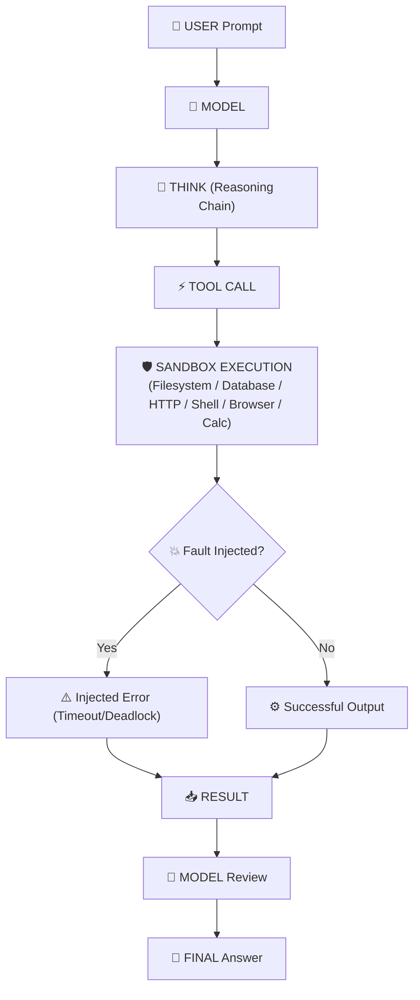

[🇸🇦 العربية](README.ar.md) | [🇬🇧 English](README.md)

# 🕹️ eidcloud-function-simulator

[](https://github.com/eidcloud/eidcloud-function-simulator/releases)
[](https://www.php.net/)
[](LICENSE)
[](https://colab.research.google.com/github/eidcloud/eidcloud-function-simulator/blob/main/notebooks/quickstart.ipynb)

> AI Function Calling Simulator & Tool Execution Sandbox with interactive terminal replay in pure PHP (Zero external vendor dependencies).

---

## 🧭 Flow Architecture

`eidcloud-function-simulator` visualizes, validates, and debugs the complete agent-to-tool invocation cycle:



---

## ⚡ Key Capabilities

- **Zero Vendor Dependencies:** 100% pure PHP 8.2+ with PSR-4 autoloading.
- **Built-in Mock Tools:**
  - 🗄️ **Database:** In-memory relational query filtering, table discovery, and record insertion.
  - 📁 **Filesystem:** Sandboxed virtual file storage (read, write, list).
  - 🌐 **HTTP Client:** REST endpoint simulation with configurable synthetic network latency.
  - 💻 **Shell:** Secure sandboxed process execution with strict command whitelisting.
  - 🌍 **Browser:** Headless DOM rendering, page metadata inspection, and form detection.
  - 🧮 **Calculator:** Accurate mathematical solver and statistical aggregator (mean, sum, min, max).
- **Interactive TUI Visualizer:** ANSI color-coded step-by-step lifecycle debugger.
- **JSON Session Recording & Replay:** Deterministic serialization of execution logs with variable replay speed (`--speed=1x`, `2x`, `instant`).
- **Deterministic Fault Injection:** Simulates timeouts, database deadlocks, missing arguments, and validates agent error-handling resilience.

---

## 🚀 Quick Start

### Installation

Clone the repository and run without any composer install step:

```bash
git clone https://github.com/eidcloud/eidcloud-function-simulator.git
cd eidcloud-function-simulator
```

### Run Simulation Scenarios

Execute built-in multi-turn agent scenarios with interactive visual output:

```bash
# Multi-turn database query and calculation
php bin/eidcloud-sim run --scenario=db-search --visual

# Mathematical evaluation and statistical calculations
php bin/eidcloud-sim run --scenario=math-solve --visual

# Web audit, HTTP health check, and sandboxed container inspection
php bin/eidcloud-sim run --scenario=web-audit --visual
```

### Save and Replay Sessions

```bash
# Save execution trace to JSON
php bin/eidcloud-sim run --scenario=db-search --visual --save=session.json

# Replay session with 2x speed
php bin/eidcloud-sim replay session.json --speed=2x
```

### Test Fault Injection

Inject simulated real-world failures into tools:

```bash
# Test database deadlock fault
php bin/eidcloud-sim run --scenario=db-search --visual --fault=deadlock

# Test synthetic tool timeout
php bin/eidcloud-sim run --scenario=db-search --visual --fault=timeout
```

---

## 🧪 Testing

Run the zero-dependency test suite (100% pass):

```bash
php tests/run_tests.php
```

---

## 👨‍💻 Author & Maintainer

**Eng. MHD. Shadi AL-Hasan**  
*EidCloud Architecture & Engineering*  
Email: [shadi@eidcloud.com](mailto:shadi@eidcloud.com)  
Website: [https://eidcloud.com](https://eidcloud.com)

---

## 📄 License

This project is licensed under the [MIT License](LICENSE) - see the LICENSE file for details.  
Copyright (c) 2026 MHD. Shadi AL-Hasan.

---

## 👤 Author & Maintainer

**Eng. MHD. Shadi AL-Hasan**  
- **Role:** Executive CTO & Enterprise Solutions Architect  
- **Email:** [mhd.shadi.alhasan@gmail.com](mailto:mhd.shadi.alhasan@gmail.com)  
- **Phone / WhatsApp:** [+963934005922](tel:+963934005922)  
- **Location:** Damascus, Syria  
- **GitHub:** [shadialhasan](https://github.com/shadialhasan)  

---

## 📄 License

This project is licensed under the MIT License - see the [LICENSE](LICENSE) file for details.  
Copyright (c) 2026 **MHD. Shadi AL-Hasan**. All rights reserved.
